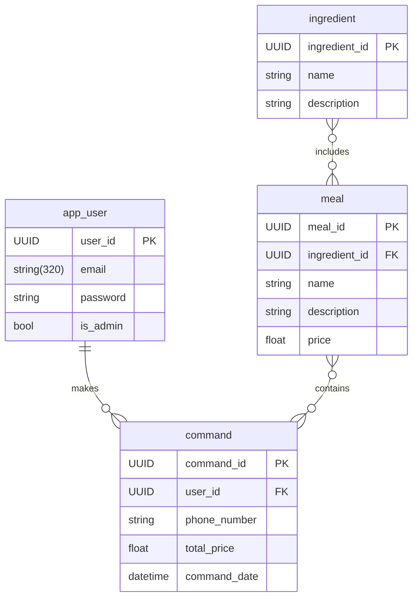

# Site pour restaurant

Ce projet est un site web pour un restaurant. Il permet de consulter les menus, les ingrédients, les recettes et de laisser des commentaires.

## Besoins fonctionnels
**Enregistrement et authentification des utilisateurs :** Les utilisateurs doivent pouvoir créer un compte et se connecter pour accéder aux fonctions de l'application web.

**Menu :** Les utilisateurs doivent pouvoir ajouter les repas qu'ils souhaitent dans le panier de l'application en choisissant parmi une liste de repas. Les repas seront pour l'instant ajoutés manuellement dans la BD. 
    
**Espace ingrédients :** Les utilisateurs doivent pouvoir consulter la liste des ingrédients des différents plats pour identifier les plats auxquels ils pourraient être allergique.

**Espace recette :** Pouvoir consulter les recettes du restaurants.

**Fonctionnalités optionnelles :**
- Espace commentaire : Pouvoir commenter, laisser des avis sur les plats goûtés ou bien poser une question. 
- Permettre à l'administrateur de l'application d'ajouter de nouveaux menus à travers le site web.

## Besoins non fonctionnels

**Réactivité :** L'application web doit être réactive et fonctionner sur tous les appareils.
    
**API REST :** Le back-end doit être une API REST.

## Base de données

